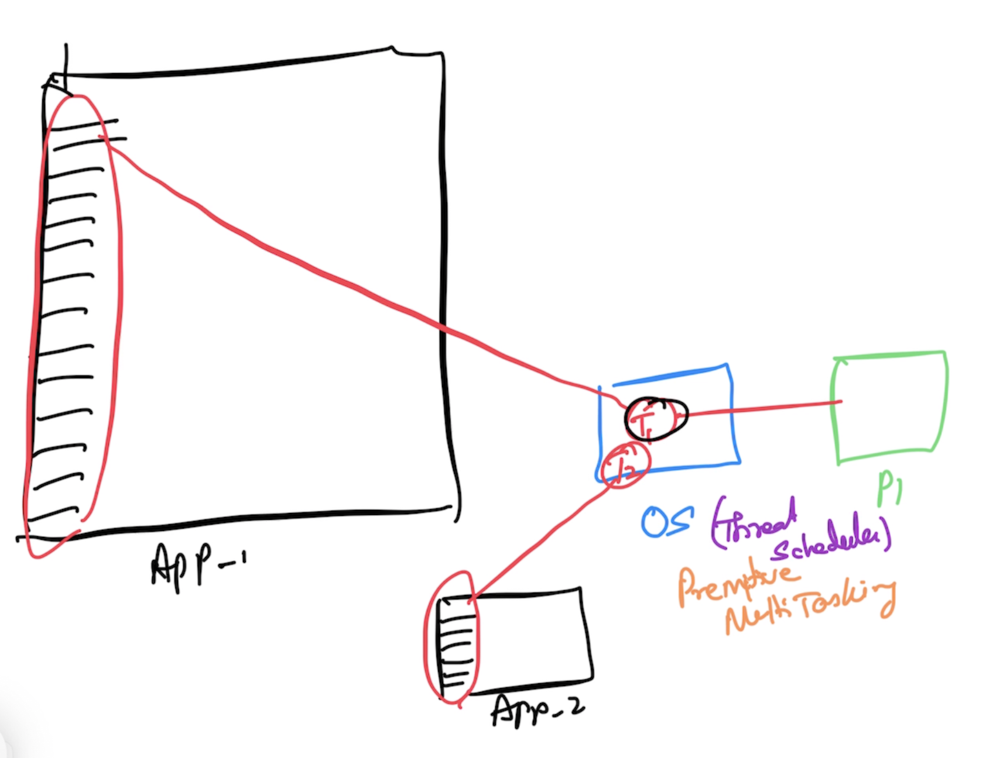
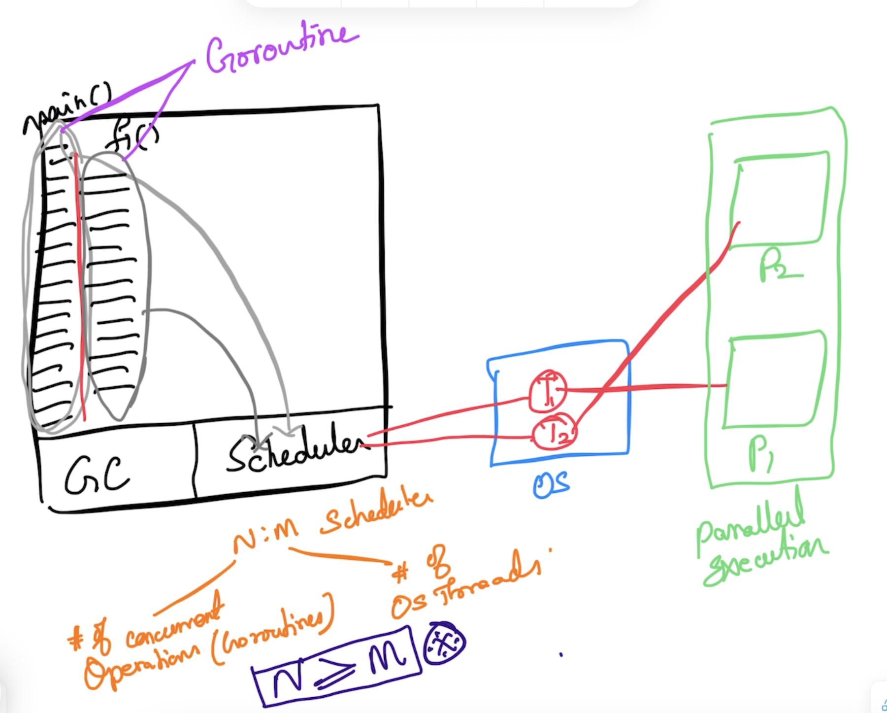
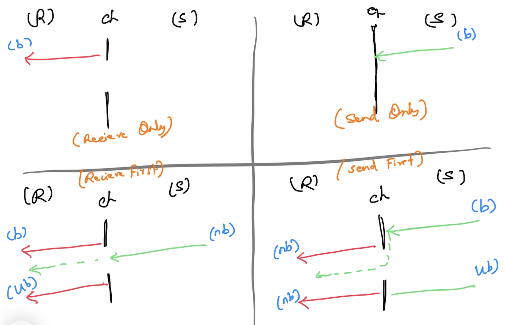

# Advanced Go

## Magesh Kuppan
- tkmagesh77@gmail.com

## Schedule
- Commence      : 09:00 AM
- Tea Break     : 10:30 AM (20 mins)
- Lunch Break   : 12:30 PM (1 hr)
- Tea Break     : 03:00 PM (20 mins)
- Wind up       : 05:00 PM

## Methodology
- No powerpoint presentation
- Discuss & Code
- No dedicated time for Q&A

## Repository
- https://github.com/tkmagesh/cisco-advgo-jul-2024

## Prerequisites
- Programming Constructs
- Higher Order Functions
- Error Handling
- Panic & Recovery
- Structs & Methods
- Struct Composition
- Interfaces
- Modules & Packages
- Concurrency (Optional)

## Software Requirements
- Go tools
- Any editor (Visual Studio Code)
- Docker Desktop (Optional)

## Review
- Higher Order Functions
- Interfaces
- Struct Composition
- Deferred Functions
- Panic & Recovery

### Higher Order Functions
- Assign functions to variables
- Pass functions as arguments
- Return a function as a return value

## Concurrency
- Ability to have more than one execution path
- Typically achieved using OS Threads
    - OS Threads are costly
        - ~2 MB of Memory (in linux)
        - Mitigate the cost of creating/destroying threads using thread pools


### Go Concurrency
- Concurrent operations are represented as "goroutines"
- goroutines are cheap (~4KB)
- Builtin scheduler
    - Go scheduler schedules the goroutine executions through the OS threads
- Concurrency support is built in the language itself
    - go keyword, channel data type, channel operator ( <- ), for-range, select-case
    - APIs support
        - "sync" package
        - "sync/atomic" package



### WaitGroup ("sync" package)
- semaphore based counter
- has the capability to block the execution of the current function until the counter becomes 0

### Data Race
```
go run --race [filename.go]
```
```
go build --race [filename.go]
```

### Channels
#### Declaration
```go
var [var_name] chan [data_type]
// ex:
var ch chan int
```
#### Instantiation
```go
[var_name] = make(chan [data_type])
// ex:
ch = make(chan int)
```
#### Combine Declaration & Instantiation
```go
ch := make(chan int)
```
#### Channel Operations
- using the channel operator ( <- )
##### Send Operation
```go
[channel_var_name] <- [data]
// ex:
ch <- 100
```
##### Receive Operation
```go
<-[channel_var_name]
// ex:
data := <-ch
```

##### Channel Behavior
- "Receive" operation is ALWAYS a blocking operation
- A "Send" operation is blocked until a "Receive" operation a initiated (conditional)
